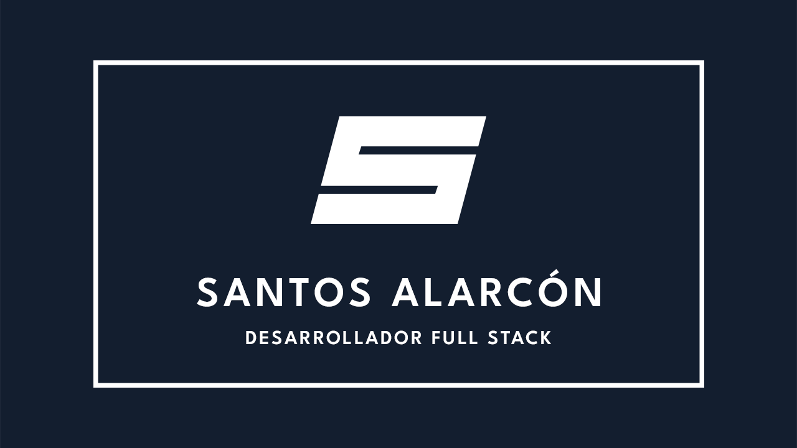

## Sobre mí 🖖

+ Me llamo **Santos Alarcón Asensio**.
+ Soy manchego de nacimiento, concretamente de la provincia de **Ciudad Real**.
+ Soy un entusiasta de la tecnología, que le encanta ponerse al día de todo (aunque con ciertos límites), tanto en tema **hardware**, **software** y **entretenimiento**. 
+ En mi GitHub encontraréis proyectos relacionados al tema de programación, sobre todo **Full Stack**.
+ Cuando no estoy trabajando o desarrollando, soy **aficionado a la cultura japonesa**, **videojuegos**, **frikismo** y la **música (80s, 90s, 2000s, remember, trance, synthwave)**.
+ En mi portátil tengo instalado **Arch Linux**, pero todavía no tengo pegatinas de las tecnologías Web.

## ¿Qué estoy haciendo ahora? 🤔
+ Ahora estoy en búsqueda activa de empleo como **programador Full-Stack**, al mismo tiempo que voy formándome en tecnologías que me permitan crecer como desarrollador. No descarto trabajar también como **desarrollador front-end**.
+ Mi propósito para este 2026 es meterme de lleno en la **programación agéntica**, **Spec-Driven Development** y mejorar el enfoque en la **accesibilidad**.
+ Estoy desarrollando **Bookmarker**, un gestor de marcadores, creado con **NextJS** y utiliza **Supabase** para la autenticación y base de datos. Además tengo otro proyecto, llamado **Next Keep**, un gestor de notas que usa **Markdown** para el estilado. Este proyecto también está construído con **NextJS**.

## Tecnologías con las que trabajo
### Front-End

  
  
  
  
  
  
  
  
  

### Back-End

  
  
  
  
  
  

### Herramientas de trabajo

  
  

## Contacto
Podéis poneros en contacto conmigo para cualquier oportunidad laboral:

  
  

<!--
**SantosAlarcon/santosalarcon** is a ✨ _special_ ✨ repository because its `README.md` (this file) appears on your GitHub profile.

Here are some ideas to get you started:

- 🔭 I’m currently working on ...
- 🌱 I’m currently learning ...
- 👯 I’m looking to collaborate on ...
- 🤔 I’m looking for help with ...
- 💬 Ask me about ...
- 📫 How to reach me: ...
- 😄 Pronouns: ...
- ⚡ Fun fact: ...
-->
